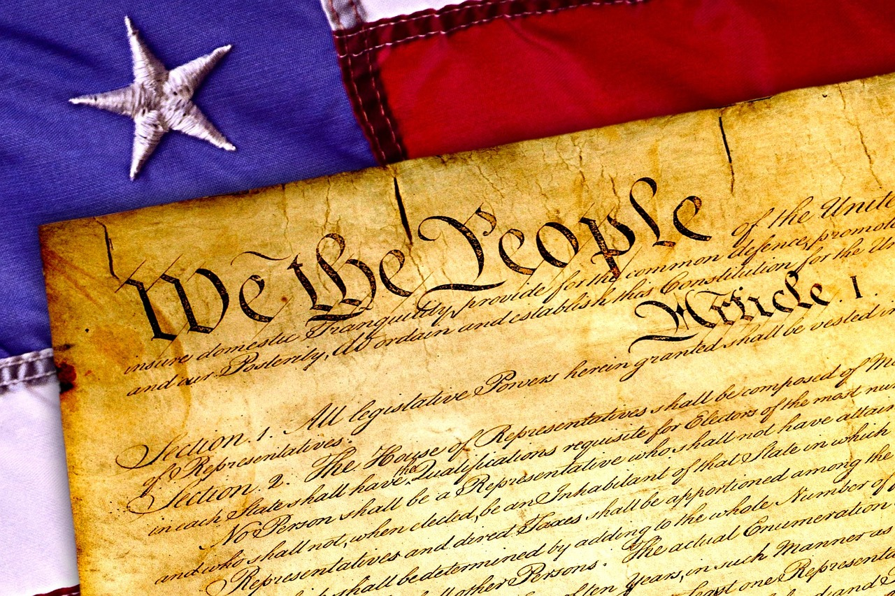

---

이번주에는 미국이 겪고있는 수 많은 문제중 가장 심각한 문제라고 생각되는 총기난사 문제에 대해서 이야기 해보도록 하겠습니다.
미국은 왜 이런 대참사들을 겪고 또 겪고도 "총기 소유 자유!"를 외치는걸까요?

이 질문에 대한 답은 사람들의 정치적 성향에 따라 바뀝니다.

### Republicans(공화당):
> 미국 헌법 2조에는 분명히 시민들이 총기 소유를 할수있는 자유를준다. 헌법에서 나오는 법을 무시하고 시민들의 권리를
빼앗어가거나 방해가되는 규제/법들은 헌법에 위반된다.

### Democrats(민주당):
> 헌법이 총기 소유를 할수있는 권리를 주는건 동의하지만 조금 더 엄격한 규제가 필요하다. 시민들이 반자동식 기계소총을
구매할수있다는건 말도 안된다.

이 쟁점을 두고 미국 여론은 심각하게 양극화 되어있습니다. 지금도 미국에서 "Gun Debate"은 끝날 여지가 보이지 않습니다.

## 베어링고 영어 블로그

#### [단어장](https://quizlet.com/_4zewyf) 꼭 참고하세요!

The Second Amendment to the United States Constitution reads:  “A well regulated Militia, being necessary to the security of a free State, the right of the people to keep and bear Arms, shall not be infringed.”

In simpler language, this means that the government should not restrict the right of the citizens to own guns, since they may need them for defense of the nation.  In the years since 1789, when the Constitution was put into effect, Americans have traditionally assumed that anyone who wants to should be able to own a gun.  Guns are usually required to be registered, and the Federal Firearms Act of 1938 prohibited the sale of guns to convicted felons, but in general, anyone who wants to can buy any type of gun that they want.

Over the past few decades, however, an increasingly large number of Americans have begun to question whether certain types of high performance guns should be available to the general public, particularly people whose past behavior has shown that they are likely to commit violent acts.  The attempted assassination of President Ronald Reagan on March 30, 1981 led to the passage of a law requiring background checks for anyone buying a gun.

School shootings, while not strictly a new phenomenon, began to be much more common in the late 1990s, for reasons which aren’t entirely clear.  Many people have begun to demand that the government make certain types of guns illegal for anyone to own, since the current system of background checks doesn’t seem to be preventing anyone from buying a gun and using it to shoot students at a school.  Most of the school shooters had never been convicted of a crime before, so a background check indicated no reason why they couldn’t buy a gun.

The complication with any such law is the Second Amendment.  Some people have argued that when the Constitution was adopted in 1789, firearms were much less powerful than modern guns, and that the writers of the Constitution would never have intended for all citizens to have powerful military-style guns.  Furthermore, since the United States has a modern professional military, they argue that there is no need for everyone to be prepared to join a volunteer militia.

Those with more conservative views argue that when the writers of the Constitution said that the government should not restrict the citizens from owning guns, they meant just that, and nothing less.  They feel that a law that would prevent everyone from owning a particular type of gun goes against what the founders of the nation intended.

As of now, nothing has been resolved.  School shootings continue to happen with disturbing regularity, and no one in government has been able to propose a solution to the problem that pleases everyone.

## 주제에 관련된 비디오:

### [Gun Debate](http://www.youtube.com/watch?v=3svs-nHtlNg)

### [Gun Violence in the US](http://www.youtube.com/watch?v=bX4qUsgHa4Y)
