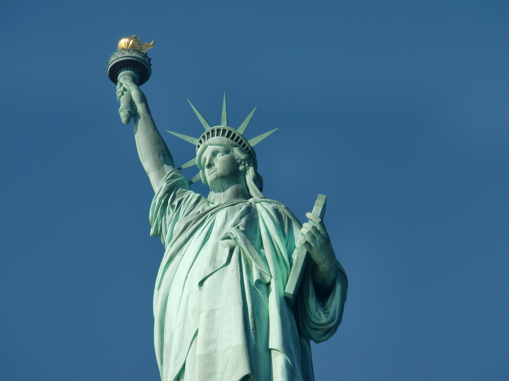

## Learning Path:
**Day 1 ~ 2 (일,월,화): 주제 공부하기**

**Day 3 ~ 4 (수,목): 글쓰기**

**Day 5 (금): 발표시간**

**Day 6 (토): 리뷰하기**

---

미국은 이민 역사로 시작해 꾸준히 성장해온 나라입니다. 이민자로 구성되있는 나라임에도 불구하고 항상 이민 문제 때문에 많은 사회적 이슈들이 언급되는데요...

베어링고에서 이민이라는 주제를 갖고 공부를 하는이유는 이 나라의 역사 뿐만 아니라 현재 미국 사회의 이슈에도 연관이 있어서 이번주 토픽으로 선정했습니다.

이번 트럼프 대통령의 강력한 정책때문에 많은 가족들이 엄청난 트라우마를 겪고 있습니다. 어른들이 다 추방되고 미국 국적인 어린애들은 갈때가 없으니 열악한 환경에서 지내야되는 사건들이 계속 반복되고있죠.

이번 베어링고 주제에서는 미국의 역사와 현재 이슈들을 엮어서 토론 해보도록 하겠습니다.   

## 베어링고 영어 블로그

#### [단어장](https://quizlet.com/_50iz2f) 꼭 참고하세요!

The United States, long seen as a land of opportunity, has always had many immigrants, although the nations from which people come have changed over the years.

In 1790, shortly after the United States became an independent nation, 85% of the population was of British ancestry. The remainder was mainly German, Dutch, French, Swedish, and of course, Africans who were enslaved.

Until about 1830, relatively few people immigrated to the U.S. Large-scale immigration began in the 1830s, mostly from Ireland, Germany, and other parts of Europe. Rates of immigration sharply increased in the 1840s, because of the Irish potato famine and unfavorable political conditions elsewhere in Europe.

Anti-immigrant tensions became widespread for a while, and for a brief time in the 1850s there was even a political party known as the Know Nothing party, which was based on anti-Catholic and anti-immigrant views. Native-born citizens worried that the new immigrants would take most of the available jobs, and Protestant Christians at the time were often suspicious of Catholics.

After gold was discovered in California in 1849, many people from China began to come to the United States. After many years of complaints from white residents of California, who resented that the Chinese immigrants were willing to work for low wages, the U.S. government passed the Chinese Exclusion Act of 1882, which banned immigration from China.

In 1890, the government decided that it needed to manage immigration more closely, and established the immigration station on Ellis Island in New York Harbor as the point where people from Europe would enter the U.S. It operated from 1892 to 1954.

Also in the 1890s, more people began to come to the U.S. from central, southern, and eastern Europe, particularly Italy. Many Jewish people also began arriving from eastern Europe, fleeing persecution. Immigration peaked in 1907, but declined shortly afterward due to World War I.

The Immigration Act of 1924 created a quota system that limited how many people could come from each country in a particular year, favoring immigrants from western Europe, and prohibiting immigrants from Asia.

Very few people came to the U.S. during the depression of the 1930s and during World War II. After the war, special legislation allowed refugees from parts of Europe that had been devastated by the war, women from other nations who had married American soldiers, and survivors of the Holocaust. Later on, refugees from Cuba and the Soviet Union were allowed as well.

In 1965, Congress passed the Immigration and Nationality Act, which ended the practice of favoring some nationalities over others. It also allowed people already in the U.S. to sponsor relatives to rejoin them in the U.S. Since the 1960s, most immigrants have come from Latin America and Asia, rather than Europe.

Towards the end of the twentieth century, the U.S. government began to focus on illegal immigration. In 1986, Congress passed the Immigration Reform and Control Act, which penalized employers who hired people who weren’t legally in the U.S. The controversy continues to the present day, and the efforts of the current U.S. administration to harshly prosecute people who enter the U.S. illegally from Mexico and Central America.

Source

https://www.history.com/topics/u-s-immigration-before-1965

## 주제에 관련된 비디오:
1. [Confusion over Immigration Policy](https://www.youtube.com/watch?v=5kmvKalVmfE)
2. [VICE News on Trump's Immigration Policy](https://www.youtube.com/watch?v=OvbEw2h8g-s)
3. [Immigration Documentary](https://www.youtube.com/watch?v=lBJcqxI7kas)
