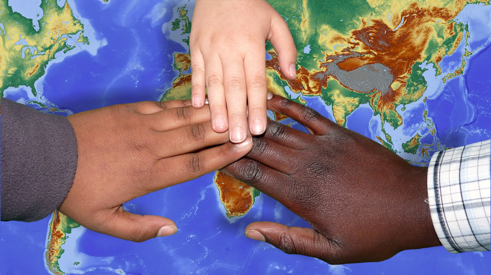

미국에서는 아시다시피 많은 인종들이 같이 어울려서 사는 나라입니다.

하지만 인종차별도 자주 볼수있는데요. 요즘 정부의 포지션때문에 인종에 관련된 문제들이 더 많이 보여지고있습니다.

이번 베어링고 토픽을 통해 미국 현재 사회를 조금 더 자세히 배워봐요~

## 베어링고 영어 블로그

#### 단어장 업데이트는 월요일에 됩니다.

African Americans have long had to deal with disadvantages that in American society.  This can mainly be traced back to the fact that in the days when the states were colonies of Great Britain, and for the first 76 years of the existence of the United States as a nation, most people of African descent who lived here were slaves.

The first African slaves were brought to the colony of Virginia in 1619, by Dutch traders who had seized them from a captured Spanish slave ship.  The practice of slavery quickly became established throughout all of the colonies, and when the colonies became independent of Great Britain after the Revolutionary War, it was included in the new Constitution which took effect in 1789.  Under the new United States laws, it was only permitted in the southern states.  However, black people who lived in the northern states were treated as second-class citizens, so that while they were free, they still weren’t seen as equal to white people.

At the end of the American Civil War in 1865, all of the slaves in the southern states were freed, and for a time it seemed that the position of African Americans in society was about to improve.  For the first time, all of them had the ability to live where they wanted, and to earn a living, and some were even elected to public office.

It didn’t last, though.  Beginning in the 1880s, states began to take action to prevent citizens of African descent from voting, and by the early 1900s, many states had laws known as “Jim Crow” laws, which required black people to have separate facilities such as restrooms, drinking fountains, and railroad cars.  The goal was to separate the white majority from the black minority as much as possible, for most white people thought of black people as inferior and as less civilized and resented having to share facilities with them.  Black children also had to attend separate schools from white children.  Here in Blacksburg, Virginia, the Lyric Theater, a movie theater that was built in 1929-1930, has a separate entrance that is now unused, but which was once the entrance that black patrons had to use so that they wouldn’t mingle with the white patrons.

In the 1950s and early 1960s, after many black men and women had served in the military during World War II only to find that they were still considered second-class citizens back at home, they began to protest against being so poorly treated.  A number of white citizens joined with them to protest laws that treated them as inferiors, and the government passed a Civil Rights Act in 1964 that ensured equal treatment for all citizens.

The issues that African American citizens have faced since 1964 are more subtle but no less frustrating.  Not being black, of course, I can only report on them secondhand, but I’ve heard enough descriptions of them from people who do have to deal with them that it seems certain that they exist.

These issues are all basically due to the fact that while legally black citizens have all of the rights as any other citizen, in practice they often find that they are still thought of as inferior, and not as civilized as white people.  Black Americans often report being observed more closely by police, and being followed around in stores by shopkeepers who clearly suspect that they plan to steal something.  A number of black men have experienced an excessive force at the hands of white police officers who seem to have assumed violent intent and therefore overreacted.  And, in the most recent incident to be widely publicized, two black men were arrested after waiting at a table in a Starbucks for a third man to join them after a store manager called police saying that they had refused to buy anything or to leave.  They were waiting for the third man to arrive before buying anything, but the store manager seemed to be suspicious of them in a way that she wouldn’t have been about two white men.

Black citizens often find, as well, that they are treated less sympathetically when struggling with issues such as poverty and drug addiction when compared with white citizens who deal with the same issues.

The question in America today is how to solve the problem.  When the law treats black citizens as inferior, the solution is to change the law.  When white citizens think of black people as inferior, and sometimes won’t even admit to themselves that they are doing so, it becomes much more difficult to figure out how to begin to change the situation.
